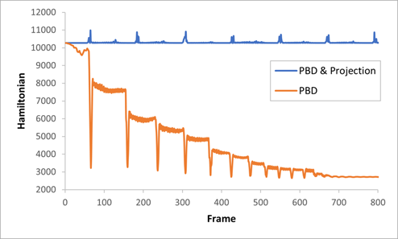

# PBDEnergyProjection
## Overview


PBDEnergyProjection is a simulation of deformable objects with the numerical energy-projection. Here, we implement eXtended Position Based Dynamics (XPBD)<sup>[1](#footnote_1)</sup>, the Small Steps technique <sup>[2](#footnote_2)</sup> and the Hamiltonian projection of Fast Energy-PRojection (FEPR)<sup>[3](#footnote_3)</sup>. This simulation is rendered using <A href="https://github.com/frostsim/DXViewer">DXViewer</A>.

## Build
This repo was developed in the following environment:
* Windows 10 64-bit
* Microsoft Visual Studio 2019 on x64 platform (C++14)
* CMake 3.19.0

You should update submodules before creating a project with cmake.

```bash
git submodule update --progress --init -- "ext/DXViewer"
```

## Results


## Reference
* <a name="footnote_1">[1]</a> Macklin, Miles, Matthias Müller, and Nuttapong Chentanez. "XPBD: position-based simulation of compliant constrained dynamics." _Proceedings of the 9th International Conference on Motion in Games_. 2016.
* <a name="footnote_2">[2]</a> Macklin, Miles, et al. "Small steps in physics simulation." _Proceedings of the 18th annual ACM SIGGRAPH/Eurographics Symposium on Computer Animation_. 2019. (2014).
* <a name="footnote_3">[3]</a> Dinev, Dimitar, et al. "FEPR: Fast energy projection for real-time simulation of deformable objects." _ACM Transactions on Graphics (TOG)_ 37.4 (2018): 1-12.
